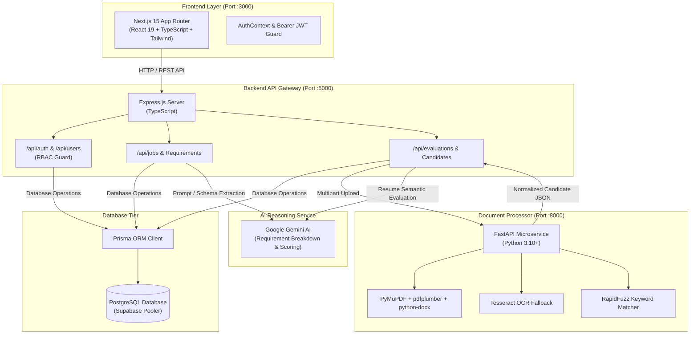

# HireIQ — Recruitment Intelligence
> **Enterprise AI-Powered Applicant Tracking System (ATS)**  
> Developed for **TaskNera** • Built with Next.js 15, Node.js/Express, Python FastAPI, PostgreSQL (Supabase), and Google Gemini AI.

---

## 📌 Executive Summary

**HireIQ** is an end-to-end Recruitment Intelligence Platform and Applicant Tracking System (ATS) tailored for enterprise talent acquisition teams, recruitment agencies, and hiring managers. It automates manual resume screening by combining **deep document extraction (OCR/PDF/DOCX)** with **Google Gemini AI semantic reasoning**, providing **verifiable evidence-based candidate scoring**, **automated job requirement extraction**, **bias-free blind screening**, and **real-time pipeline analytics**.

---

## 🌟 Key Capabilities & System Features

### 1. 🎨 Recruiter Experience & Frontend (`/FrontEnd`)
- **Modern Dark Interface**: Tailored dark theme (`#060C1A`) with glassmorphism, responsive data grids, and micro-interactions.
- **Product Showcase & Landing (`/home`)**:
  - Interactive hero section with live evaluation previews.
  - **Bias Guard Showcase**: Anonymized candidate review mode (masks PII: name, photo, gender, contact details) for merit-first evaluations.
  - Candidate comparison matrix and resume parsing workflow diagrams.
- **Recruiter Command Center (`/dashboard`)**:
  - Live KPIs: Active Jobs, Candidates Evaluated, Shortlisted Candidates, Average Match Scores.
  - Real-time recruitment activity stream and quick action shortcuts.
- **Job Creation & JD Intelligence (`/jobs/create`)**:
  - Multi-step job setup: Client specification, title, location, work mode (Remote/Hybrid/Onsite), and salary ranges.
  - Automated JD parsing via file upload (PDF/DOCX) or raw text paste.
  - AI extraction of granular requirements categorized by Technical Skills, Experience, and Education.
- **Requirement Weighting & Audit Matrix (`/jobs/[id]/requirements`)**:
  - Dynamic importance weights (1.0x to 3.0x multiplier).
  - Mandatory requirement toggles ("must-have" vs. "nice-to-have").
  - Evidence-required flags and recruiter confirmation audit checkpoints.
- **Candidate Evaluation & Pipeline (`/candidates`)**:
  - Match badge indicators (`High`, `Medium`, `Low`) with composite fit scores (0–100%).
  - Detailed scorecard view showing paragraph citations from the candidate's CV as proof for each requirement.
  - Instant recruiter decision controls: **Shortlist**, **Reject**, or **Hold**.
- **Executive Administration (`/admin`)**:
  - Restricted to designated Administrator (`sheetalbedi@tasknera.com`).
  - Recruiter team provisioning, pod assignment, and role management.
- **Talent Analytics (`/analytics`)**:
  - Recruitment funnel metrics: *Applied → Parsed → Evaluated → Shortlisted → Offered*.
  - Hiring velocity and recruiter evaluation throughput reports.

---

### 2. ⚙️ Backend API & Services (`/backend`)
- **RESTful Architecture**: Modular controllers, route guards, and typed services built with Express and TypeScript.
- **Authentication & Security**:
  - JSON Web Tokens (JWT) signed with HMAC-SHA256 for stateless authentication.
  - Salted password encryption via `bcryptjs`.
  - Google OAuth2 integration (`google-auth-library`).
  - Role-Based Access Control (RBAC) supporting `ADMIN`, `TEAM_LEADER`, and `MEMBER`.
  - Auto-initialization of designated administrator credentials on server boot.
- **Relational Persistence via Prisma ORM**:
  - Hosted PostgreSQL database powered by Supabase with connection pooler (`pgbouncer`).
  - Structured schemas for Users, Jobs, Requirements, Candidates, Evaluations, and Audit Logs.

---

### 3. 📄 Document Intelligence Microservice (`/document_processor`)
- **High-Performance Python Service**: Built on FastAPI and Uvicorn.
- **Multi-Format Extraction**:
  - **PyMuPDF (`fitz`) & pdfplumber**: Fast vector text and tabular extraction from PDFs.
  - **python-docx**: Native XML parsing for Microsoft Word resumes.
  - **Tesseract OCR (`pytesseract` & `pdf2image`)**: Fallback optical character recognition for scanned resumes and images.
- **Semantic Normalization**:
  - Contact information extraction (email, phone, LinkedIn, GitHub).
  - Experience chronology calculation and degree level normalization.
  - Fuzzy keyword & skill matching using **RapidFuzz**.

---

### 4. 🧠 Artificial Intelligence Engine
- Powered by **Google Gemini 1.5 / 2.0 Flash** (`@google/genai`).
- Performs structured JSON-schema extraction for Job Description requirements.
- Cross-evaluates candidate resumes against job criteria to generate fit rationales and identify specific candidate skill gaps.

---

## 🏛️ System Architecture



---

## 🗄️ Database Schema Overview (`backend/prisma/schema.prisma`)

| Model | Table | Key Fields | Description |
| :--- | :--- | :--- | :--- |
| `User` | `users` | `id`, `email`, `password`, `name`, `role`, `team_id`, `organization_id` | Recruiter and admin user profiles with RBAC. |
| `Job` | `jobs` | `id`, `client`, `position`, `jd_file_url`, `jd_text`, `work_mode`, `salary`, `status`, `created_by` | Job openings and vacancy specifications. |
| `Requirement`| `requirements` | `id`, `job_id`, `requirement`, `category`, `weight`, `is_mandatory`, `evidence_required` | Granular criteria extracted from the JD with weights. |
| `Candidate` | `candidates` | `id`, `job_id`, `name`, `email`, `phone`, `resume_file_url`, `status`, `score` | Applicant profiles and uploaded resume references. |
| `Evaluation` | `evaluations` | `id`, `job_id`, `candidate_id`, `overall_score`, `category_scores`, `strengths`, `weaknesses` | Comprehensive AI match evaluations and citations. |

---

## 📁 Repository Structure

```
ATS/
├── FrontEnd/                     # Next.js 15 React 19 Frontend
│   ├── public/                   # Static assets, brand logos, and favicons
│   │   ├── tasknera-logo-symbol.png
│   │   ├── tasknera-full-logo-transparent.png
│   │   └── favicon.ico
│   ├── src/
│   │   ├── app/                  # App Router pages (home, dashboard, jobs, candidates, admin, etc.)
│   │   ├── components/           # UI components, header, footer, evaluation cards
│   │   ├── context/              # AuthContext & session state
│   │   ├── lib/                  # API client helpers and local state stores
│   │   └── types/                # TypeScript interface definitions
│   ├── package.json
│   └── tailwind.config.js
│
├── backend/                      # Node.js + Express + TypeScript API Server
│   ├── prisma/
│   │   └── schema.prisma         # Database schema & model definitions
│   ├── src/
│   │   ├── config/               # Prisma database client & environment loaders
│   │   ├── controllers/          # Business logic (auth, jobs, candidates, evaluations, users)
│   │   ├── middleware/           # JWT verification & RBAC authorization middleware
│   │   ├── routes/               # Express REST route endpoints
│   │   ├── services/             # Gemini AI and document processor integrations
│   │   └── server.ts             # Application entry point & default admin initializer
│   ├── package.json
│   └── tsconfig.json
│
├── document_processor/           # Python FastAPI Document Extraction Microservice
│   ├── app/
│   │   ├── services/             # Document parsing, OCR fallback, and AI matcher
│   │   └── main.py               # FastAPI application router & endpoints
│   └── requirements.txt          # Python dependencies (PyMuPDF, pdfplumber, pytesseract, etc.)
│
├── package.json                  # Root workspace runner (concurrent orchestration)
└── README.md                     # System documentation
```

---

## 🛠️ Technology Stack

| Domain | Technology | Details |
| :--- | :--- | :--- |
| **Frontend** | Next.js 15.1, React 19, TypeScript | Modern App Router architecture, responsive UI |
| **Styling** | Tailwind CSS, Lucide Icons | Custom high-contrast dark theme (`#060C1A`) |
| **Backend API** | Node.js 20+, Express 4.21, TypeScript | RESTful API, structured error handling, async queues |
| **Database & ORM** | PostgreSQL, Prisma ORM 5.22 | Hosted on Supabase with IPv4 transaction pooler |
| **Document Processing** | Python 3.10+, FastAPI, Uvicorn | PyMuPDF, pdfplumber, python-docx, Pillow |
| **OCR Fallback** | Tesseract OCR (`pytesseract`) | Optical Character Recognition for image-based PDFs |
| **AI Evaluation** | Google Gemini 1.5 / 2.0 (`@google/genai`) | LLM requirement extraction and candidate reasoning |
| **Security & Auth** | JWT (`jsonwebtoken`), `bcryptjs`, OAuth2 | Role-based authorization, encrypted passwords |

---

## 🚀 Getting Started

### Prerequisites
- **Node.js**: `v18.x` or `v20.x` (LTS recommended)
- **npm**: `v9.x` or higher
- **Python**: `3.10` or higher
- **PostgreSQL Database** (or Supabase project instance)
- **Tesseract OCR** (optional, recommended for scanned resume support)

---

### 1. Installation

#### Install Node.js dependencies for root, frontend, and backend:
```bash
npm run install:all
```

#### Set up Python virtual environment for Document Processor:
```bash
cd document_processor
python -m venv venv

# Windows (PowerShell):
.\venv\Scripts\Activate.ps1
# Linux / macOS:
source venv/bin/activate

pip install -r requirements.txt
cd ..
```

---

### 2. Environment Configuration

#### Backend (`backend/.env`):
```env
PORT=5000
DATABASE_URL="postgresql://<user>:<password>@<host>:6543/postgres?pgbouncer=true"
DIRECT_URL="postgresql://<user>:<password>@<host>:5432/postgres"
JWT_SECRET="ats_tasknera_super_secret_jwt_key_2026"
GOOGLE_CLIENT_ID="your_google_client_id.apps.googleusercontent.com"
DOCUMENT_PROCESSOR_URL="http://127.0.0.1:8000"
GEMINI_API_KEY="your_google_gemini_api_key"


```

#### Frontend (`FrontEnd/.env` or `FrontEnd/.env.local`):
```env
NEXT_PUBLIC_API_URL="http://localhost:5000/api"
NEXT_PUBLIC_GOOGLE_CLIENT_ID="your_google_client_id.apps.googleusercontent.com"
BACKEND_API_URL="http://127.0.0.1:5000/api"
GEMINI_API_KEY="your_google_gemini_api_key"
NEXT_PUBLIC_GEMINI_API_KEY="your_google_gemini_api_key"
```

#### Document Processor (`document_processor/.env`):
```env
PORT=8000
HOST="0.0.0.0"
```

---

### 3. Database Migration

Push the Prisma schema to your PostgreSQL database:
```bash
cd backend
npx prisma generate
npx prisma db push
cd ..
```

---

### 4. Running the Platform

#### Option A: Run all services concurrently (Recommended)
From the project root:
```bash
npm run dev
```
*This uses `concurrently` to launch Frontend (`:3000`), Backend (`:5000`), and Document Processor (`:8000`) in one command.*

#### Option B: Run services individually

```bash
# Terminal 1: Frontend (Next.js)
npm run dev:frontend

# Terminal 2: Backend (Express)
npm run dev:backend

# Terminal 3: Document Processor (FastAPI)
npm run dev:python
```

Open your browser at **`http://localhost:3000`** to access the application.

---

## 📡 REST API Reference

### Authentication (`/api/auth`)
- `POST /api/auth/signin` — Authenticate recruiter with email & password.
- `POST /api/auth/google` — Sign in via verified Google OAuth token.
- `GET /api/auth/me` — Retrieve profile & role of current session.

### Job Openings (`/api/jobs`)
- `GET /api/jobs` — Retrieve job list with client, status, and location filters.
- `POST /api/jobs` — Post a new vacancy (supports file JD upload or raw text).
- `GET /api/jobs/:id` — Get specific job details and extracted requirements.
- `PUT /api/jobs/:id/requirements` — Update requirement weights, mandatory flags, and audit statuses.

### Candidate Pipeline & Evaluations (`/api/evaluations` & `/api/candidates`)
- `POST /api/candidates/upload-resume` — Upload candidate CV to the document processor.
- `POST /api/evaluations/evaluate` — Trigger Gemini AI candidate evaluation against JD criteria.
- `GET /api/evaluations` — List all evaluation records.
- `GET /api/evaluations/:id` — Retrieve full candidate evaluation scorecard and resume evidence citations.
- `POST /api/evaluations/:id/decision` — Set candidate decision (`Shortlist`, `Reject`, `Hold`).

### Member & Team Management (`/api/users` - Admin Only)
- `POST /api/users/create-member` — Provision a new recruiter account.
- `PATCH /api/users/:id/role` — Update a user's role (`ADMIN`, `TEAM_LEADER`, `MEMBER`).
- `PATCH /api/users/:id/team` — Assign a user to a specific talent acquisition pod.
- `DELETE /api/users/:id` — Remove a member account.

---

## 🔒 Security & Access Control (RBAC)

- **Cryptographic Security**: Passwords hashed with 10 salt rounds (`bcryptjs`).
- **Protected Endpoints**: Checked by `protect` middleware validating JWT Bearer tokens.
- **Admin Endpoints**: Guarded by `authorize('ADMIN')` restricting modification of company members and system-wide roles.
- **Blind Review / Bias Guard**: Anonymizes candidate demographic attributes during the initial screening stages.

---

## 👥 Organization & Attribution

**HireIQ** is maintained and engineered by the **TaskNera IT Team**.

- **Organization**: TaskNera ([tasknera.com](https://tasknera.com))
- **Copyright**: © 2026 TaskNera. All rights reserved.
