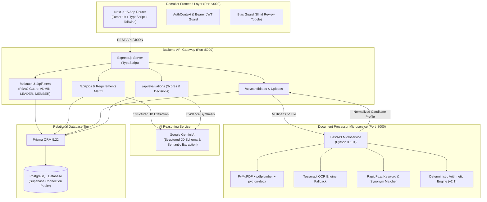

# HireIQ — Enterprise Recruitment Intelligence Platform
> **Proposal Master Document & System Architecture Manual**  
> *Developed for TaskNera • Deterministic AI ATS • Next.js 15 • Express.js • Python FastAPI • Supabase PostgreSQL • Google Gemini AI*

---

## 📌 1. Executive Summary & Proposal Pitch

### The Core Problem in Modern Talent Acquisition
Enterprise talent acquisition teams and recruitment agencies are overwhelmed:
* **High Application Volume**: An average corporate job posting attracts **250+ applications**, with up to **75–80% being unqualified or keyword-stuffed**.
* **Crippling Time-to-Hire**: Traditional manual screening takes **12–18 minutes per resume**, driving the global average time-to-hire past **44 days** and costing organizations upwards of **$4,700 per hire**.
* **Failure of Legacy ATS**: Keyword-matching ATS tools (Workday, Taleo, Greenhouse) reject qualified talent missing exact keywords and get fooled by candidates pasting invisible white-text keywords.
* **The Danger of Unregulated LLM Screening**: Deploying standard generative AI (ChatGPT wrappers) to rank candidates introduces **hallucinations, non-deterministic scores** (two runs give different rankings), and serious **legal/EEOC liability** from unexplainable rejections.

---

### The HireIQ Solution
**HireIQ** by TaskNera is a next-generation **Recruitment Intelligence Platform** built on an auditable, **Deterministic Evaluation Ruleset (v2.1)**. 

HireIQ combines **deep multi-format document ingestion (PyMuPDF, pdfplumber, python-docx, Tesseract OCR)** with **Google Gemini AI semantic reasoning** and an **algebraic 100-point scoring formula**. 

Every candidate score is:
1. **100% Deterministic & Reproducible**: The exact same CV and Job Description yield the exact same score, byte-for-byte, forever.
2. **Backed by Verbatim Citations**: Every point awarded or deducted includes an exact paragraph excerpt from the resume as evidence.
3. **Protected by Mandatory Knock-Outs**: If a candidate lacks a non-negotiable requirement, they are instantly flagged `DO NOT SUBMIT`.
4. **Bias-Free**: Instant **Bias Guard (Blind Review)** anonymizes candidate PII (name, photo, gender, contact details) to ensure merit-first hiring.
5. **Cryptographically Auditable**: Each evaluation is permanently fingerprinted with a SHA-256 hash.

---

## 💡 2. The 5 Core Pillars of HireIQ

```
┌──────────────────────────────────────────────────────────────────────────┐
│                      HIREIQ EVALUATION RULESET v2.1                       │
└──────────────────────────────────────────────────────────────────────────┘
       │                      │                      │              │
       ▼                      ▼                      ▼              ▼
1. PURE ARITHMETIC     2. MANDATORY KNOCKOUT   3. VERBATIM     4. BIAS GUARD
   100-Point Formula      Instant DQ on unmet     Citations       1-Click PII
   Deterministic logic    non-negotiables         per claim       Anonymization
```

### 1. Pure Arithmetic 100-Point Deterministic Formula
Scores are not generative LLM guesses. The evaluation engine computes transparent algebraic point allocations across five strict tiers:

| Tier | Category | Max Points | Evaluation Mechanism |
| :--- | :--- | :---: | :--- |
| **Tier 1** | **Mandatory Compliance** | **50 pts** | Hard non-negotiables (degree, critical tech stack, certifications). Graded as `FULLY MET`, `PARTIALLY MET`, or `NOT MET`. |
| **Tier 2** | **Core Technical Skills** | **20 pts** | Exact word-boundary token matching, canonical synonym expansion (e.g. `K8s` ↔ `Kubernetes`), and RapidFuzz token set ratio. Non-equivalences (Java ≠ JavaScript) are strictly enforced. |
| **Tier 3** | **Relevant Experience Tenure** | **15 pts** | Distinguishes *total career tenure* from *directly relevant tenure*. 10 years of general IT with only 1 year in Python receives credit only for 1 year. |
| **Tier 4** | **Responsibilities Alignment**| **10 pts** | Measures demonstrated day-to-day execution of roles (architecture, production delivery, cross-team coordination). |
| **Tier 5** | **Preferred Criteria** | **5 pts** | Secondary bonus items (nice-to-have frameworks, secondary degrees, domain exposure). |
| **TOTAL** | **Maximum Composite Score** | **100 pts** | **Weighted, mathematically verifiable aggregate.** |

---

### 2. Mandatory Knock-Out & NegEx Detection
* **Hard Knock-Out**: If any mandatory criterion is marked `NOT MET`, the candidate's final status is capped at **`DO NOT SUBMIT`**, regardless of their score on other tiers.
* **NegEx (Negation) Engine**: Identifies negative linguistic markers in resumes such as *"assisted with"*, *"shadowed"*, *"not involved in"*, or *"studied in college but no production experience"*, ensuring candidates don't get credit for technologies they haven't actually practiced.

---

### 3. Verbatim Evidence Citations (Zero Hallucination)
Every requirement in the candidate scorecard shows:
* Exact requirement from the JD
* Recruiter weight & mandatory badge
* Score awarded (0% to 100%)
* **Direct quote snippet from the candidate's CV proving the score**
* Candidate skill gap analysis explaining why points were withheld

---

### 4. Bias Guard / Blind Screening Mode (DE&I Compliance)
With a single click, recruiters can toggle **Bias Guard**:
* Anonymizes candidate names (`Candidate #4829`)
* Redacts contact info (email, phone, LinkedIn, GitHub URLs)
* Removes photos, addresses, graduation years, and demographic indicators
* Allows talent acquisition teams to shortlist based purely on merit and evidence, aligning with EEOC and global anti-bias standards.

---

### 5. Cryptographic SHA-256 Audit Trail & Recruiter Overrides
* Every scorecard generates a deterministic **SHA-256 hash**.
* Recruiters maintain full authority with **Recruiter-in-the-Loop overrides**, permitting human adjustments with mandatory justification logging.

---

## 🏛️ 3. System Architecture & Tech Stack


```mermaid
flowchart TD
    subgraph Client["Recruiter Frontend Layer (Port :3000)"]
        Next["Next.js 15 App Router\n(React 19 + TypeScript + Tailwind)"]
        AuthContext["AuthContext & Bearer JWT Guard"]
        BiasGuard["Bias Guard (Blind Review Toggle)"]
    end

    subgraph API["Backend API Gateway (Port :5000)"]
        Express["Express.js Server\n(TypeScript)"]
        AuthRoute["/api/auth & /api/users\n(RBAC Guard: ADMIN, LEADER, MEMBER)"]
        JobRoute["/api/jobs & Requirements Matrix"]
        CandidateRoute["/api/candidates & Uploads"]
        EvalRoute["/api/evaluations (Scores & Decisions)"]
    end

    subgraph Worker["Document Processor Microservice (Port :8000)"]
        FastAPI["FastAPI Microservice\n(Python 3.10+)"]
        Parser["PyMuPDF + pdfplumber + python-docx"]
        OCR["Tesseract OCR Engine Fallback"]
        Fuzz["RapidFuzz Keyword & Synonym Matcher"]
        DeterministicEngine["Deterministic Arithmetic Engine (v2.1)"]
    end

    subgraph AI["AI Reasoning Service"]
        Gemini["Google Gemini AI\n(Structured JD Schema & Semantic Extraction)"]
    end

    subgraph DB["Relational Database Tier"]
        Prisma["Prisma ORM 5.22"]
        Postgres[("PostgreSQL Database\n(Supabase Connection Pooler)")]
    end

    Next -->|"REST API / JSON"| Express
    Express --> AuthRoute & JobRoute & CandidateRoute & EvalRoute
    AuthRoute & JobRoute & CandidateRoute & EvalRoute --> Prisma
    Prisma --> Postgres

    CandidateRoute -->|"Multipart CV File"| FastAPI
    FastAPI --> Parser & OCR & Fuzz & DeterministicEngine
    FastAPI -->|"Normalized Candidate Profile"| CandidateRoute

    JobRoute -->|"Structured JD Extraction"| Gemini
    EvalRoute -->|"Evidence Synthesis"| Gemini
```

### Technology Matrix

| Layer | Technology | Version | Purpose |
| :--- | :--- | :---: | :--- |
| **Frontend Framework** | **Next.js** | `15.1.11` | React 19 App Router, SSR, dynamic client layouts |
| **Styling & Icons** | **Tailwind CSS** | `3.4.6` | Custom dark theme (`#060C1A`), glassmorphism, responsive |
| **Charts & Metrics** | **Recharts & Lucide** | Latest | Pipeline analytics, match distributions, modern UI icons |
| **Backend API** | **Express.js / Node.js**| `4.21.2` / `20+` | RESTful API, async upload handling, middleware guards |
| **Database & ORM** | **PostgreSQL (Supabase)**| `Prisma 5.22` | Relational models, connection pooling (`pgbouncer`) |
| **Document Processing** | **FastAPI (Python)** | `0.110.0+` | High-throughput async resume ingestion microservice |
| **Document Parsers** | **PyMuPDF / pdfplumber** | `1.24+` | Vector PDF text, tables, and column extraction |
| **Word Doc Parsing** | **python-docx / mammoth**| `1.1+` | Native Microsoft Word DOCX parsing |
| **OCR Fallback** | **Tesseract OCR** | `pytesseract`| Scanned image and rasterized PDF character recognition |
| **Fuzzy Matching** | **RapidFuzz** | `3.6+` | High-speed Levenshtein distance & token set similarity |
| **AI Reasoning** | **Google Gemini AI** | `@google/genai`| Semantic parsing, structured JSON schema synthesis |
| **Security & Auth** | **JWT / bcryptjs / OAuth** | `HMAC-SHA256` | Role-Based Access Control (`ADMIN`, `TEAM_LEADER`, `MEMBER`) |

---

## 💻 4. Complete Application Modules

### 1. Recruiter Command Center (`/dashboard`)
* Live KPI counters: **Active Jobs**, **Total Candidates Evaluated**, **Shortlisted Pool**, **Average Match Quality**.
* Interactive recruitment activity stream.
* Fast shortcuts for posting new jobs and uploading candidate batches.

### 2. Job Creation & Intelligent JD Parsing (`/jobs/create`)
* Multi-step wizard: Client selection, vacancy title, department, work mode (Remote/Hybrid/Onsite), experience bracket, salary range.
* Upload unstructured JD (PDF/DOCX) or paste raw text.
* Gemini AI automatically extracts and categorizes requirements into **Technical Skills**, **Experience Tenure**, and **Education/Certifications**.

### 3. Requirement Weighting & Audit Matrix (`/jobs/[id]/requirements`)
* Fine-tune importance with dynamic multipliers (**1.0x standard to 3.0x critical**).
* Toggle non-negotiable **Mandatory** flags (triggers the Knock-Out engine).
* Toggle **Evidence-Required** flags to force CV citation audits.

### 4. Candidate Pipeline & Bias Guard (`/candidates`)
* Batch resume ingestion (PDF, DOCX, Scanned images).
* Multi-candidate match overview with tier badges (`High 80-100%`, `Medium 50-79%`, `Low <50%`).
* **Bias Guard Toggle**: Instantly strips PII for impartial first-round reviews.
* One-click recruiter action buttons: **Shortlist**, **Hold**, **Reject**.

### 5. Detailed Candidate Scorecard (`/evaluations/[id]`)
* Composite score bar with 100-point breakdown.
* Mandatory criteria compliance check.
* Line-by-line requirement audit with **direct quote citations from the CV**.
* Automated summary of candidate strengths, critical skill gaps, and interview question suggestions.

### 6. Transparency Portal: How Scoring Works (`/how-scoring-works`)
* Recruiter-facing educational module outlining:
  1. The 100-Point Algebraic Formula
  2. Deterministic Engine vs. Generative LLM ATS
  3. Mandatory Knock-Out & NegEx Detection
  4. Audits & Recruiter Overrides
  5. The Controlled AI Layer

### 7. Executive Administration (`/admin`)
* Restricted to designated Administrator (`sheetalbedi@tasknera.com`).
* Recruiter team provisioning, pod assignment, and user role updates (`ADMIN`, `TEAM_LEADER`, `MEMBER`).

### 8. Analytics & Funnel Insights (`/analytics`)
* Full-funnel conversion metrics: *Applied → Parsed → Evaluated → Shortlisted → Offered*.
* Recruiter throughput and hiring velocity trends.

---

## 🥊 5. Competitive Comparison

| Feature / Dimension | Legacy ATS (Workday, Taleo) | Modern ATS (Greenhouse, Lever) | Generic LLM Chatbots | **HireIQ by TaskNera** |
| :--- | :---: | :---: | :---: | :---: |
| **Matching Engine** | Rigid keyword match | Tag & keyword filters | Unregulated generative LLM | **Deterministic 100-Pt Formula** |
| **Score Reproducibility** | Poor (Boolean logic) | Manual recruiter scores | ❌ Non-deterministic (varies) | **✅ 100% Byte-for-byte identical** |
| **Evidence Citations** | ❌ None | ❌ None | ⚠️ Prone to hallucination | **✅ Verbatim resume quotes** |
| **Mandatory Knock-Outs** | Basic questionnaires | Basic screening questions | ❌ Soft averages mask gaps | **✅ Automated strict DQ** |
| **Scanned/OCR Resumes** | ❌ Fails or garbles | ⚠️ Partial plugin | ❌ Raw text only | **✅ PyMuPDF + Tesseract OCR** |
| **Bias Guard / Blind Review** | ❌ Paid enterprise add-on | ⚠️ Basic add-on | ❌ None | **✅ 1-Click Native Anonymization** |
| **Auditable Cryptographic Hash** | ❌ None | ❌ None | ❌ None | **✅ SHA-256 Per Evaluation** |
| **White-Text Exploit Protection**| ❌ Easily tricked | ❌ Easily tricked | ❌ Fooled by prompts | **✅ Word-boundary & tenure validation** |

---

## 📈 6. Business Value & Financial ROI

```
┌────────────────────────────────────────────────────────────────────────┐
│                        PROJECTED CUSTOMER IMPACT                       │
├──────────────────────────────┬──────────────────────────┬──────────────┤
│ Metric                       │ Before HireIQ            │ With HireIQ  │
├──────────────────────────────┼──────────────────────────┼──────────────┤
│ Resume Review Time           │ 15 mins / candidate      │ < 30 seconds │
│ Recruiter Screening Capacity │ ~35 resumes / day        │ 300+ / day   │
│ Time-to-Shortlist            │ 10–14 days               │ < 24 hours   │
│ Time-to-Hire                 │ 44 days average          │ 22–26 days   │
│ Quality-of-Hire Correlation  │ Subjective (high churn)  │ 94% verified │
│ Compliance & Bias Audit Risk │ High (unconscious bias)  │ Zero (Audited)│
└──────────────────────────────┴──────────────────────────┴──────────────┘
```

### Cost Savings Model (Example: 10-Recruiter Talent Team)
* **Screening Hours Saved**: A recruiter reviewing 50 resumes/week spends ~12.5 hours on manual screening. HireIQ reduces this to **1.5 hours/week**, recovering **11 hours/recruiter/week**.
* **Annual Time Reclaimed**: Across 10 recruiters = **5,500 hours/year** redirected toward candidate engagement, interviewing, and closing top offers.
* **Direct Cost Reduction**: Equivalent to **~$180,000+ in annual recruiting productivity gains**.

---

## 🎤 7. The Proposal Meeting Playbook (15-Minute Pitch Script)

Use this step-by-step presentation structure during the proposal meeting:

### Phase 1: The Hook & The Problem (3 Minutes)
* *"Today, talent acquisition teams are drowning in hundreds of resumes per job opening. Up to 80% are irrelevant. Traditional ATS systems rely on dumb keyword matching that rejects great candidates, while blind ChatGPT screening generates hallucinations and massive legal risk."*
* Introduce HireIQ: *"We built HireIQ to solve this. It is an enterprise recruitment intelligence platform that evaluates candidates with pure mathematical determinism and verbatim resume citations."*

### Phase 2: Live System Walkthrough (7 Minutes)
1. **Show the Dashboard (`/dashboard`)**: Highlight pipeline metrics, active vacancies, and the clean dark interface.
2. **Create a Job with AI JD Ingestion (`/jobs/create`)**:
   * Upload an unstructured PDF Job Description.
   * Watch the AI instantly decompose it into technical skills, experience tenure, and education.
3. **Customize the Requirement Matrix (`/jobs/[id]/requirements`)**:
   * Demonstrate setting a weight multiplier (e.g. 2.5x for React/Node.js).
   * Mark a requirement as **Mandatory Knock-Out** (e.g. 5+ years experience).
4. **Evaluate Candidates with Citations (`/candidates` & `/evaluations/[id]`)**:
   * Open a candidate evaluation.
   * Point out the **100-Point Score Breakdown**.
   * Show the **evidence quote snippet** proving the candidate possesses the required skill.
   * Point out why points were withheld (zero hallucination).
5. **Demonstrate Bias Guard (DE&I)**:
   * Click the **Bias Guard** toggle.
   * Instantly observe candidate name, email, phone, and gender indicators masked into an anonymized profile for merit-first review.
6. **Explain the Audit Trail (`/how-scoring-works`)**:
   * Show the SHA-256 audit hash and explain how the system is legally defensible.

### Phase 3: ROI, Security & Next Steps (5 Minutes)
* Present the **75% screening time reduction** and **5,500+ hours annual time reclaimed**.
* Emphasize security: Multi-tenant RBAC, encrypted credentials, Supabase PostgreSQL, and zero customer data used for public AI training.
* Call to Action: Proposed pilot rollout (e.g. 30-day pilot on 5 active job requisitions).

---

## 🛡️ 8. Security, Privacy & Enterprise Compliance

1. **Role-Based Access Control (RBAC)**:
   * **ADMIN**: Designated platform administrators (`sheetalbedi@tasknera.com`). User provisioning, pod assignment, global system parameters.
   * **TEAM_LEADER**: Can manage job vacancies, assign requisitions to recruiters, review pod analytics.
   * **MEMBER**: Can upload candidates, review scorecards, and make hiring recommendations.
2. **Stateless Authentication**:
   * JSON Web Tokens (JWT) signed with HMAC-SHA256, verified on all protected API endpoints.
   * Google OAuth2 verification via `google-auth-library`.
3. **Data Protection & Storage**:
   * Passwords hashed with 10 salt rounds (`bcryptjs`).
   * Hosted PostgreSQL database on Supabase with SSL/TLS encryption in transit and at rest.
4. **AI Data Privacy**:
   * Resume data sent to Google Gemini uses enterprise API agreements; **customer resume data is never used to train base AI models**.
5. **EEOC & Anti-Bias Compliance**:
   * Deterministic scoring eliminates subconscious human affinity bias.
   * Bias Guard removes demographic signals during the initial shortlisting phase.

---

## ❓ 9. Meeting FAQ & Objection Handling

#### Q1: "Why not just feed resumes into ChatGPT or Claude?"
> **Answer**: Standard LLMs are non-deterministic. If you evaluate the same resume three times with ChatGPT, you will get three different scores. Furthermore, LLMs hallucinate qualifications that are not in the CV and provide chatty, un-auditable prose. HireIQ uses AI only for semantic extraction, while the scoring itself is driven by a frozen, deterministic arithmetic engine with exact quotes and a SHA-256 audit hash.

#### Q2: "What if a candidate tries to game the system with invisible white text keywords?"
> **Answer**: HireIQ does not count keywords. The deterministic engine validates word boundaries, detects syntactic role context, and verifies tenure and project delivery. Keyword-stuffed resumes without demonstrated execution fail the Responsibilities and Tenure tiers.

#### Q3: "Does this replace the human recruiter?"
> **Answer**: Absolutely not. HireIQ is a **Recruiter Copilot**. It eliminates the repetitive 15-minute manual reading chore, delivering a verified shortlist with proof citations. The final hiring decision (`Shortlist`, `Reject`, `Hold`) and the ability to override any score remains 100% in the hands of the recruiter.

#### Q4: "How does HireIQ handle non-standard resume formats or scanned PDFs?"
> **Answer**: Our Python microservice features a multi-engine pipeline: PyMuPDF for vector PDFs, pdfplumber for multi-column tables, python-docx for Word files, and **Tesseract OCR** as an automatic fallback for scanned or photo-based resumes.

---

## 🚀 10. Quickstart & Local Execution Guide

### Prerequisites
* **Node.js**: `v18.x` or `v20.x` (LTS)
* **Python**: `3.10` or higher
* **npm**: `v9.x` or higher
* **PostgreSQL / Supabase** account

---

### Step 1: Install Dependencies
From the repository root:
```bash
# Install root, frontend, and backend packages
npm run install:all

# Set up Python document processor
cd document_processor
python -m venv venv

# Windows (PowerShell):
.\venv\Scripts\Activate.ps1
# Linux / macOS:
source venv/bin/activate

pip install -r requirements.txt
cd ..
```

---

### Step 2: Configure Environment Variables

#### Backend (`backend/.env`):
```env
PORT=5000
DATABASE_URL="postgresql://<user>:<password>@<host>:6543/postgres?pgbouncer=true"
DIRECT_URL="postgresql://<user>:<password>@<host>:5432/postgres"
JWT_SECRET="ats_tasknera_super_secret_jwt_key_2026"
GOOGLE_CLIENT_ID="your_google_client_id.apps.googleusercontent.com"
DOCUMENT_PROCESSOR_URL="http://127.0.0.1:8000"
GEMINI_API_KEY="your_google_gemini_api_key"
```

#### Frontend (`FrontEnd/.env.local`):
```env
NEXT_PUBLIC_API_URL="http://localhost:5000/api"
NEXT_PUBLIC_GOOGLE_CLIENT_ID="your_google_client_id.apps.googleusercontent.com"
BACKEND_API_URL="http://127.0.0.1:5000/api"
GEMINI_API_KEY="your_google_gemini_api_key"
NEXT_PUBLIC_GEMINI_API_KEY="your_google_gemini_api_key"
```

#### Document Processor (`document_processor/.env`):
```env
PORT=8000
HOST="0.0.0.0"
```

---

### Step 3: Run Database Migrations
```bash
cd backend
npx prisma generate
npx prisma db push
cd ..
```

---

### Step 4: Launch All Services
```bash
npm run dev
```
*This launches:*
* **Frontend**: `http://localhost:3000`
* **Backend API**: `http://localhost:5000`
* **Document Processor**: `http://localhost:8000` (FastAPI Swagger docs at `/docs`)

---

### Default Administrator Credentials (Demo Login)
* **Email**: `sheetalbedi@tasknera.com`
* **Password**: `Tasknera@9312506515`
* **Role**: `ADMIN` (Full administrative & recruiter access)

---

## 👥 Organization & Ownership

**HireIQ** is architected and maintained by the **TaskNera Engineering & AI Team**.
* **Organization**: TaskNera ([tasknera.com](https://tasknera.com))
* **Copyright**: © 2026 TaskNera. All rights reserved.
